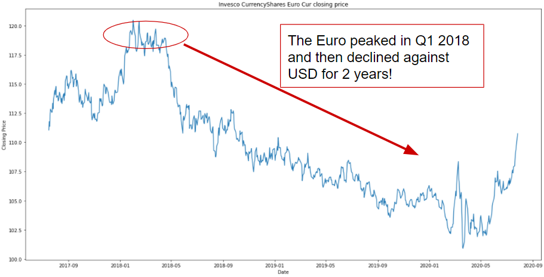
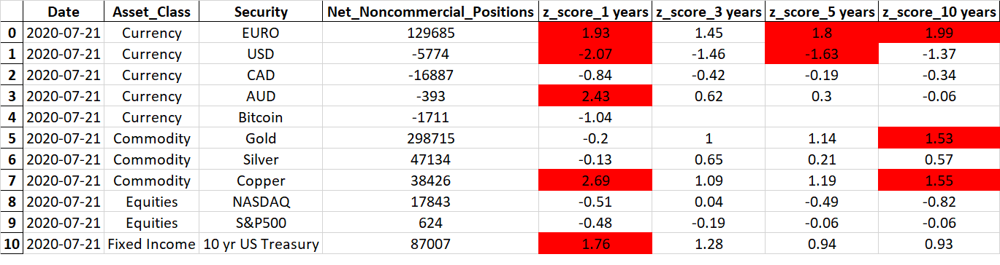

# Identifying Market Consensus using CFTC Weekly Data.
***_Project Goal:_*** to identify and aggregate data to quantify the current market consensus on a selected security. 
## Introduction
By using the weekly Commitments of Trader (CoT) report from the CFTC, I calculated the current net position in the futures/options traded on the selected security.

To demonstrate, below is the current net positioning on the Euro and the price performance of the Euro over the same time frame.

As you can see in the 'CFTC' chart the high point on the left of the chart (roughly April of 2018) was in fact the highest Net Long position in the EURO in the currency's history. In other words, according to this data market sentiment had never been as positive/bullish in 20 years! And as you can see with the price chart April 2018 was also the high point for the EURO, and preceded a 2 year decline in the EURO against the USD.

## Research Questions

The final summary table is below, with z-scores that are above or below the over-under-bought threshold highlighted in red. 

Simply put I've identified a number of securities and calculated the Current Net positioning in the security. Then to provide further context to the data I calculated a z-score. The z-score indicates how many standard deviations the current positioning is from the average and therefore whether the current positioning appears extended or not. By using a z-score we can also compare multiple securities across multiple asset classes on an “apples to apples” basis. And get a quantified measure of the current market sentiment across the entire macro landscape.

**How does this data inform a potential investment strategy?** 

I believe this is a great quantitative tool to gauge the current market consensus on a given security. By using z-scores we can identify whether this positioning is extreme or not and can compare securities across asset classes 'apples to apples'. 

To conclude I wouldn't use this data by itself to establish a position (long or short) in a security. However, this is great data to use to help with market timing and help determine appropriate position size for each security.

## Results - Summary Table
The data manipulation can be found in the [CFTC_data.ipynb](CFTC_data.ipynb) notebook

The data manipulation and summary chart can be found in the [FinalDataAnalysis.ipynb](FinalDataAnalysis.ipynb) notebook 

Below is an example Summary Table:

## Conclusion/recommendations
I believe this data is informative for investors in terms of market timing and positioning and gives a quantitative foundation to inform investors of the current 'market consensus'.